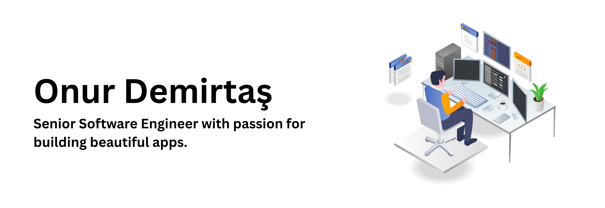

<h1 align="center">Hi 👋, I'm Onur</h1>

-------------------
&emsp;
<h3 align="left">Senior Software Engineer with over 8 years of experience in full stack development specializing in building scalable and high-performance web and mobile applications.</h3>
&emsp;

-------------------
&emsp;

- 🔭 I’m currently working on [Devzilla](https://play.google.com/store/apps/details?id=com.demirtas.devzilla)(Tech Skill Testing Platform). 

- 📚 I’m currently learning **Machine Learning and Kotlin(For Native Android Development)**.

- 💬 My favourite languages and technologies: **React, Typescript, React Native, Vue.js, GraphQL and Node.js**.

&emsp;

## Me around the web:
-------------------

 &emsp;
  
 

 &emsp;

## 🛠️ My Skills
-------------------
### Programming languages:
&emsp;

### Frontend & Mobile development:
&emsp;

### Backend development:
&emsp;

### Misc tools:
&emsp;

### Services & Frameworks:
&emsp;

### Databases:
&emsp;

### DevOps:
&emsp;

&emsp;

## 📈 My GitHub Stats and Activity

### 💻 Profile Stats

 
 

### 🔥 Streak Stats

------
Credit: [Onur Demirtaş](https://onurdemirtas.com)
Last Edited on: 06.10.2025
